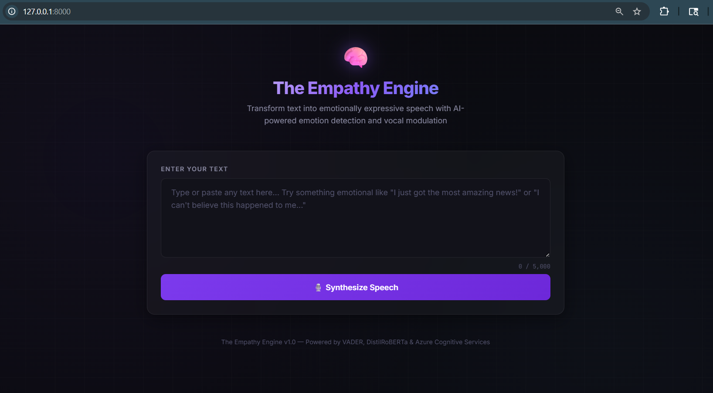
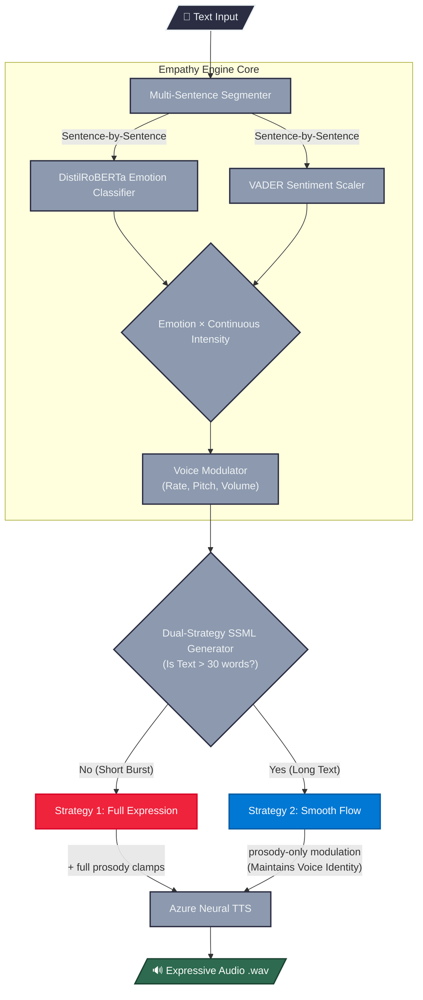

# 🧠 The Empathy Engine

**Emotionally Intelligent Text-to-Speech** — A service that dynamically modulates the vocal characteristics of synthesized speech based on the detected emotion of the source text.


<div align="center">
 
  
</div>

## Overview

The Empathy Engine bridges the gap between text-based sentiment and expressive, human-like audio output. Instead of monotonic delivery, it analyzes the emotional content of your text and adjusts speech parameters — rate, pitch, volume, and speaking style — to achieve emotional resonance.

### ✨ Core Features & Highlights

- **🎯 Granular Emotion Analysis**: Instead of applying a single blanket emotion to a long text, the engine performs **sentence-by-sentence** contextual emotion detection (7 classes) using locally hosted `DistilRoBERTa`.
- **📈 Intensity-Scaled Voice Modulation**: Emotions aren't just on or off. Using VADER sentiment analysis, the engine calculates a continuous intensity score (0.0–1.0) and linearly scales the voice parameters (rate, pitch, volume) so the delivery perfectly matches the text's energy.
- **🧠 Dual-Strategy SSML (Special Feature)**: Our dynamic SSML generator intuitively switches strategies based on text length:
  - *Short text*: Uses full Azure `<mstts:express-as>` styles for maximum theatrical expression.
  - *Long text*: Disables categorical styles to prevent the voice character from "breaking" between sentences, instead using purely clamped prosody modulation to maintain a **smooth, continuous emotional flow** with the exact same voice identity.
- **💻 Interactive Web UI**: A sleek, dark-themed FastAPI web interface that provides live audio synthesis, complete with a visual breakdown of per-sentence emotions, reasoning, and the exact voice configurations applied.


---

## Architecture Overview



### Dual-Strategy SSML

| | Single Sentence (or <30 words) | Multi-Sentence (>30 words) |
|---|---|---|
| **Goal** | Maximum expressiveness | Voice continuity |
| **express-as** | ✅ Full (styledegree up to 2.0) | ❌ Disabled |
| **Rate** | ±30% | ±20% |
| **Pitch** | ±50Hz | ±15Hz |
| **Volume** | ±20% | ±12% |


---

## Setup

### 1. Clone & create virtual environment

```bash
git clone <your-repo-url>
cd tts
python -m venv venv
venv\Scripts\activate         # Windows
# source venv/bin/activate    # macOS/Linux
```

### 2. Install dependencies

```bash
pip install -r requirements.txt
```

### 3. (Optional) Configure Azure TTS

Copy the example environment file and add your Azure Speech API key:

```bash
copy .env.example .env
# Edit .env with your Azure credentials
```

> **Without Azure credentials**, the engine falls back to pyttsx3 (offline, basic quality).  
> **With Azure credentials**, you get high-quality neural voices with native emotion styles.
>
> Get a free Azure Speech key (500K characters/month) at [portal.azure.com](https://portal.azure.com) → Create a "Speech" resource.

---

## Usage

### CLI Mode

```bash
python main.py --mode cli
```

Type any text and the engine will:
1. Detect the emotion and intensity
2. Display the vocal parameter configuration
3. Generate an expressive `.wav` audio file

Type `demo` to run a set of sample emotional texts.

### Web Mode

```bash
python main.py --mode web
```

Open [http://127.0.0.1:8000](http://127.0.0.1:8000) in your browser. API documentation is available at [http://127.0.0.1:8000/docs](http://127.0.0.1:8000/docs).

### API Endpoint

```bash
curl -X POST http://127.0.0.1:8000/synthesize \
  -H "Content-Type: application/json" \
  -d '{"text": "I am so happy today!"}'
```

---

## Design: Emotion-to-Voice Mapping

The core of the Empathy Engine is a mapping table that translates detected emotions into vocal parameter deltas. Each delta is **scaled linearly by the emotion's intensity** (0.0–1.0), so a mild "This is good" produces subtle changes while an emphatic "This is the BEST news EVER!!" produces dramatic shifts.

| Emotion | Rate Δ | Pitch Δ | Volume Δ | Azure Style | Rationale |
|---|---|---|---|---|---|
| Joy | +20→+50 | +15→+40 | +0.05→+0.15 | `cheerful` | Faster, higher, louder — excited delivery |
| Surprise | +30→+60 | +20→+50 | +0.05→+0.15 | `excited` | Quick, high-pitched exclamation |
| Anger | +10→+30 | −5→−15 | +0.10→+0.20 | `angry` | Forceful, deep, loud — commanding tone |
| Fear | +15→+40 | +10→+25 | −0.10→−0.20 | `fearful` | Fast, high, quiet — whispered urgency |
| Sadness | −20→−50 | −10→−30 | −0.05→−0.15 | `sad` | Slow, low, soft — subdued delivery |
| Disgust | −10→−25 | −5→−15 | +0.00→+0.10 | `disgruntled` | Slow, low — disdainful tone |
| Neutral | 0 | 0 | 0 | `default` | No modulation — standard delivery |

### Emotion Detection Pipeline

1. **VADER** (rule-based): Provides the compound valence score (−1 to +1), from which we derive the **intensity** (`abs(compound) × 1.25`, capped at 1.0).
2. **DistilRoBERTa** (transformer): Classifies text into one of 7 emotion categories with confidence scores.
3. **Combined**: VADER's intensity scales the DistilRoBERTa label's corresponding vocal parameter deltas.

---

## Project Structure

```
tts/
├── main.py                    # Entry point (--mode cli|web)
├── cli.py                     # Interactive CLI interface
├── app.py                     # FastAPI web server
├── requirements.txt           # Python dependencies
├── .env.example               # Azure credentials template
├── empathy_engine/
│   ├── __init__.py
│   ├── emotion_detector.py    # VADER + DistilRoBERTa emotion detection
│   ├── voice_modulator.py     # Emotion → voice parameter mapping
│   ├── tts_engine.py          # Azure TTS + pyttsx3 dual engine
│   └── engine.py              # Orchestrator
├── templates/
│   └── index.html             # Web UI
├── tests/
│   ├── test_emotion.py        # Emotion detector tests
│   ├── test_modulator.py      # Voice modulator tests
│   └── test_engine.py         # Integration tests
└── output/                    # Generated audio files
```

---

## Tech Stack

- **Python 3.9+**
- **VADER** — Rule-based sentiment intensity
- **HuggingFace Transformers** — `j-hartmann/emotion-english-distilroberta-base`
- **Azure Cognitive Services Speech** — Neural TTS with SSML emotion styles
- **pyttsx3** — Offline TTS fallback (SAPI5)
- **FastAPI** — Web framework with auto-generated API docs
